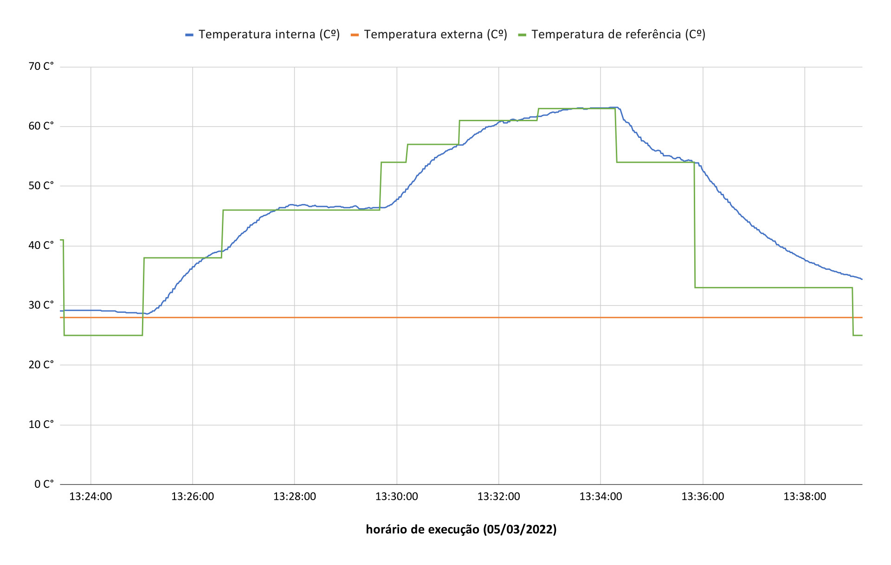
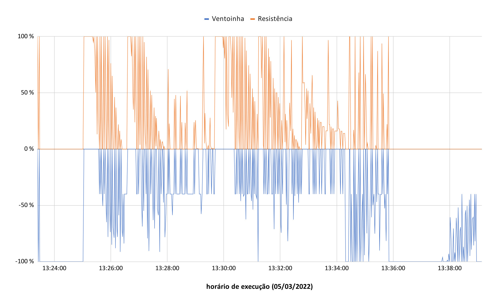
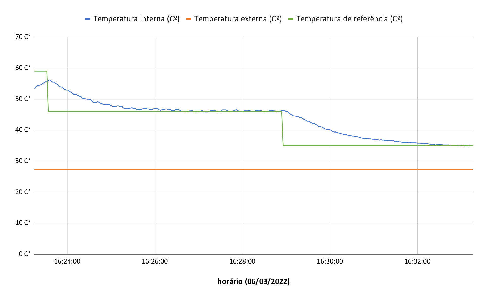
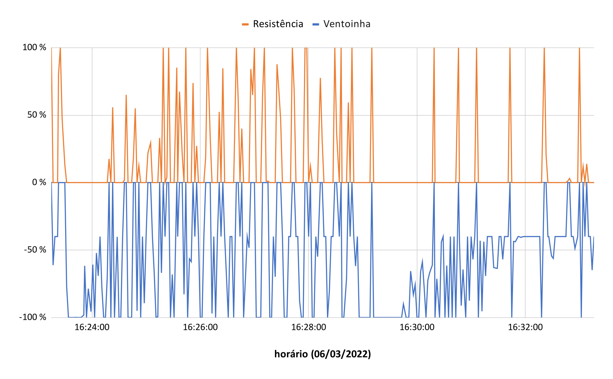

# FSE_Trabalho_1

Repositório para o trabalho 1 da disciplina de Fundamentos de Sistemas Embarcados (FGA-UnB).

[Enunciado](https://gitlab.com/fse_fga/trabalhos-2021_2/trabalho-1-2021-2)

## Dependências do trabalho

---

* [WiringPi](https://github.com/WiringPi/WiringPi)
* gcc
* make

## Como executar

---

Primeiramente devemos compilar usando o comando abaixo:

```bash
make all
```

Caso ja exista um copilação utilize o comando abaixo para limpar copilações existentes:

```bash
make clear
```

Para executar, após a copilação use o comando abaixo:

```bash
make run
```

## Utilização

---

Para utilização digite o numero da opção desejada e tecle ENTER.

É necessário configurar o controle PID (Proporcional Integral Derivativo) logo ao iniciar o programa, existem configurações padrões existentes para os ambientes que foram disponibilizados na disciplina.

Após configurado o PID escolha um modo de operação:

- Terminal: É escolhida um temperatura de referência e o sistema trabalha para alcançar essa temperatura até sua interrupção.
- UART: Neste modo o sistema usara por padrão a temperatura do potenciômetro, podendo ser posteriormente mudada para curva reflow ao acionar o botão correspondente;

## Tela LCD 16x2

---

No tela LCD será exibido:

Sigla    | Significado
---------|------------------------------------------------------------------------------------------------------------------
TERMINAL | Significa que o modo terminal foi escolhido.
UARTPOT  | Significa que o modo UART com temperatura de referência baseada no potenciômetro foi escolhida.
UARTCURV | Significa que o modo UART com temperatura de referência baseada no arquivo curva reflow foi escolhido.
Tr       | Temperatura de Referência (Defina pelo terminal, potenciômetro ou arquivo [curva_reflow.csv](./curva_reflow.csv))
Ti       | Temperatura Interna (Forno)
Te       | Temperatura Externa (Ambiente)                                                                                 

## LOG

---

O sistema gerará um arquivo log.csv que guarda as temperaturas Tr, Ti e Te, sinal de controle da resistência e ventoinha, além da data e horário.

## Testes

---

Os testes foram feitos durante 10 minutos para cada forma do modo UART, com potenciômetro e arquivo curva reflow.

O sinal de controle para temperatura varia entre -100 e 100:

 Sinal de controle | Operação do sistema            
-------------------|--------------------------------
 100               | Resistência na potência máxima 
 0                 | Ambos desligados               
 -100              | Ventoinha na potência máxima   

Vale destacar que a ventoinha sempre executa uma velocidade maior que 40 (velocidade mínima), é possível notar esse comportamento com o arquivo log.csv.

Teste modo UART utilizando arquivo curva reflow (Testado na rasp42 com a configuração PID padrão do sistema para o mesmo):

| Temperaturas                                                |
|-------------------------------------------------------------|
|  |

| Sinal de controle                                                   |
|---------------------------------------------------------------------|
|  |

Teste modo UART utilizando potenciômetro (Testado na rasp43 com a configuração PID padrão do sistema para o mesmo):

| Temperaturas                                              |
|-----------------------------------------------------------|
|  |

| Sinal de controle                                                 |
|-------------------------------------------------------------------|
|  |
